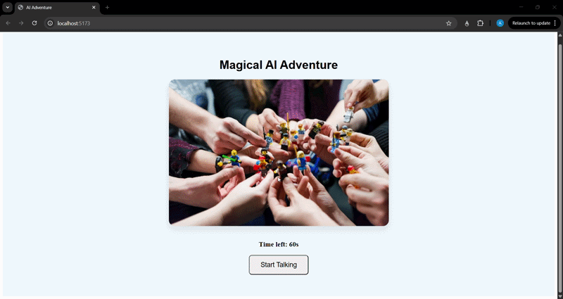

Magical AI Adventure (Real-Time Voice UI)



A full-stack, real-time multimodal AI application built with **React**, **NestJS**, and the **Gemini Multimodal Live API**. 

This project creates an interactive, 1-minute voice adventure for children. It features a cheerful AI "cartoon dog" that can see the user's screen, hold a natural low-latency voice conversation, and dynamically change the UI background color based on the child's vocal requests using Tool Calling.

Key eatures
* **Real-Time Bidirectional Audio:** Streams raw PCM16 audio (16kHz input / 24kHz output) over WebSockets for instant, natural conversation without REST API latency delays.
* **Multimodal Context:** The AI is fed a visual context (an image of a park) upon connection, allowing it to "see" and discuss the UI with the user.
* **Function Calling (Tools):** The AI listens for color preferences and triggers a `change_background_color` tool call over the WebSocket to instantly update the React frontend state.
* **Audio Queue Management:** Implements precise Web Audio API scheduling to prevent audio chunk overlapping and stuttering.
* **Time-Constrained Persona:** Enforces a strict 1-minute conversation limit, prompting the AI to naturally wrap up the interaction.

Tech Stack
* **Frontend:** React, Vite, Web Audio API (Native PCM processing)
* **Backend:** Node.js, NestJS (WebSocket Gateway)
* **AI Model:** `gemini-2.5-flash-native-audio-preview-09-2025`

---

Getting Started

Prerequisites
* Node.js (v18 or higher)
* A Google Gemini API Key

1. Backend Setup (NestJS)
Navigate to the backend directory and install the dependencies:
```bash
cd backend
npm install
